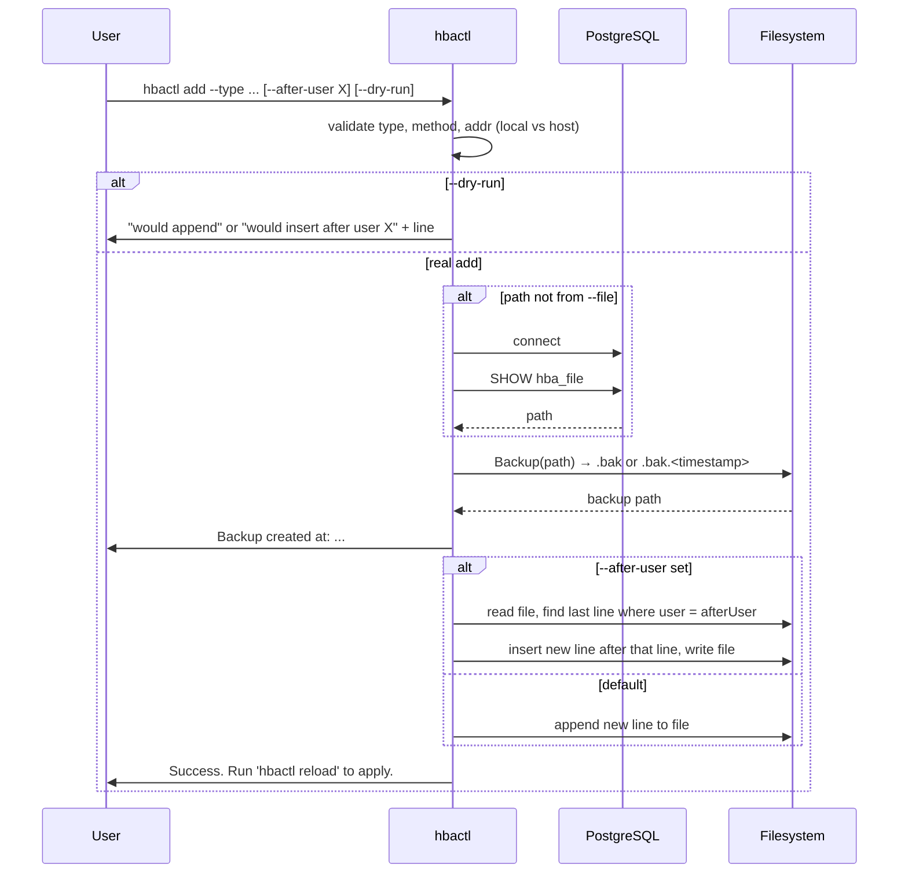

# hbactl add — Sequence

Add a rule: backup, then append at end or insert after last rule for a user (`--after-user`). `--dry-run` only prints the line.

[General](sequence-general.md) · [List](sequence-list.md) · [Remove](sequence-remove.md) · [Check](sequence-check.md) · [Reload](sequence-reload.md)
