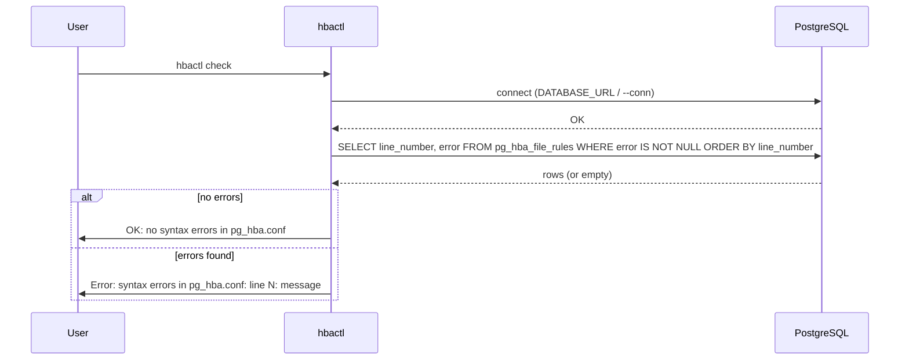

# hbactl check — Sequence

Validate `pg_hba.conf` using the `pg_hba_file_rules` view. Requires a connection.

[General](sequence-general.md) · [List](sequence-list.md) · [Add](sequence-add.md) · [Reload](sequence-reload.md)
