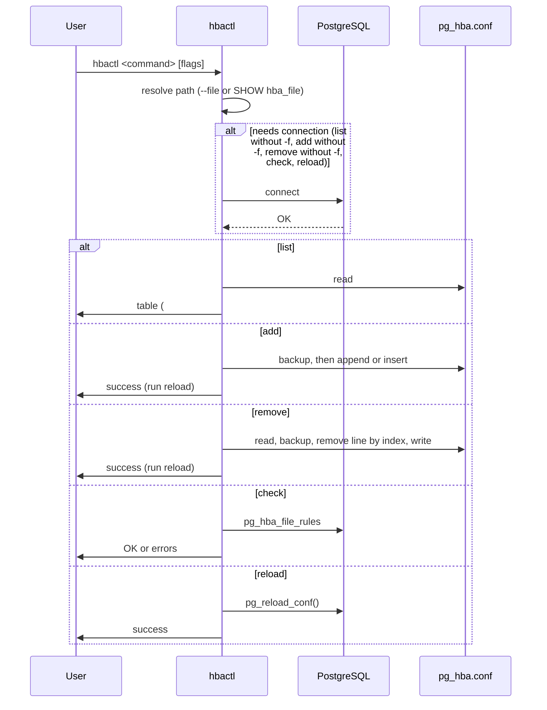

# hbactl — General flow

High-level view: user runs a command; optionally connects to PostgreSQL to discover or validate; reads or writes `pg_hba.conf` on the filesystem.

[List](sequence-list.md) · [Add](sequence-add.md) · [Remove](sequence-remove.md) · [Check](sequence-check.md) · [Reload](sequence-reload.md)
