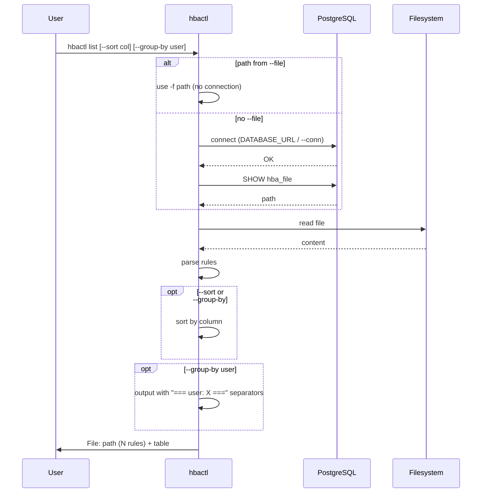

# hbactl list — Sequence

List rules from `pg_hba.conf` in a table. Path from `--file` or from PostgreSQL (`SHOW hba_file`).

[General](sequence-general.md) · [Add](sequence-add.md) · [Check](sequence-check.md) · [Reload](sequence-reload.md)
