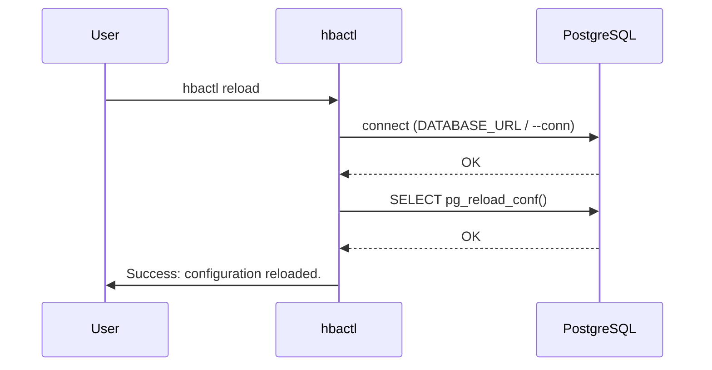

# hbactl reload — Sequence

Ask PostgreSQL to reload configuration so changes to `pg_hba.conf` take effect without restart.

[General](sequence-general.md) · [List](sequence-list.md) · [Add](sequence-add.md) · [Check](sequence-check.md)
