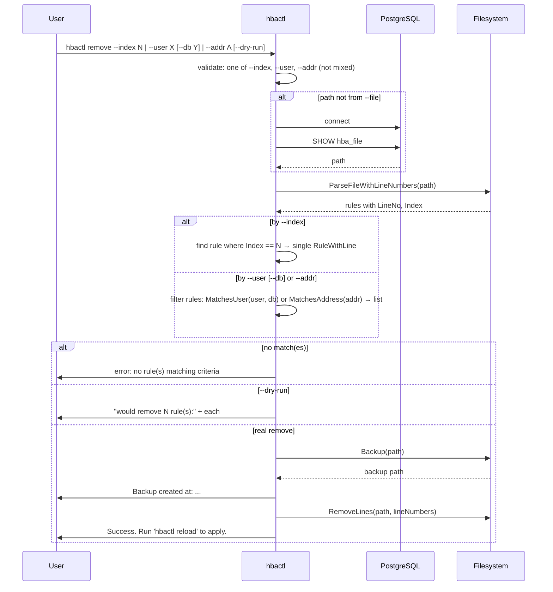

# hbactl remove — Sequence

Remove one rule by **`--index`** or all matching rules by **`--user`** [**`--db`**] or **`--addr`**. Backup, then delete the line(s); **`--dry-run`** only prints what would be removed.

[General](sequence-general.md) · [List](sequence-list.md) · [Add](sequence-add.md) · [Check](sequence-check.md) · [Reload](sequence-reload.md)
